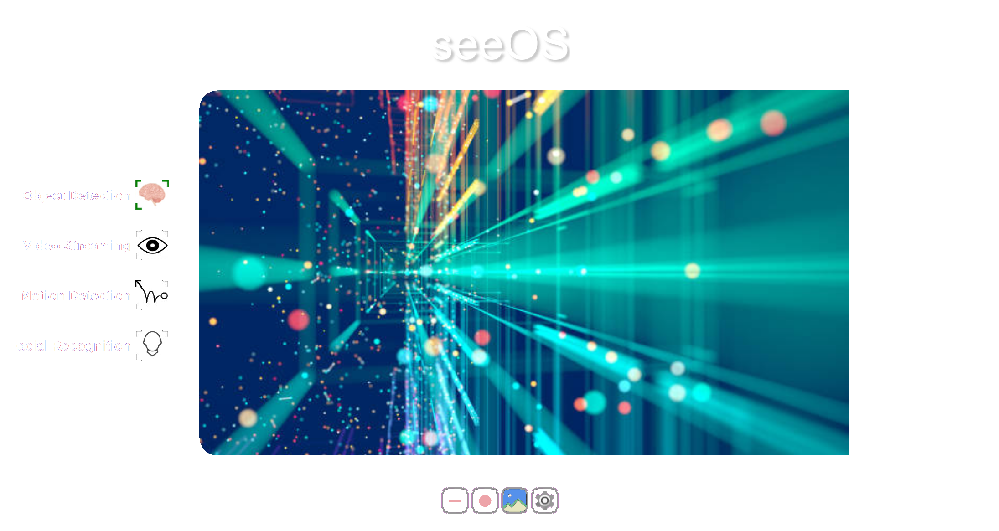
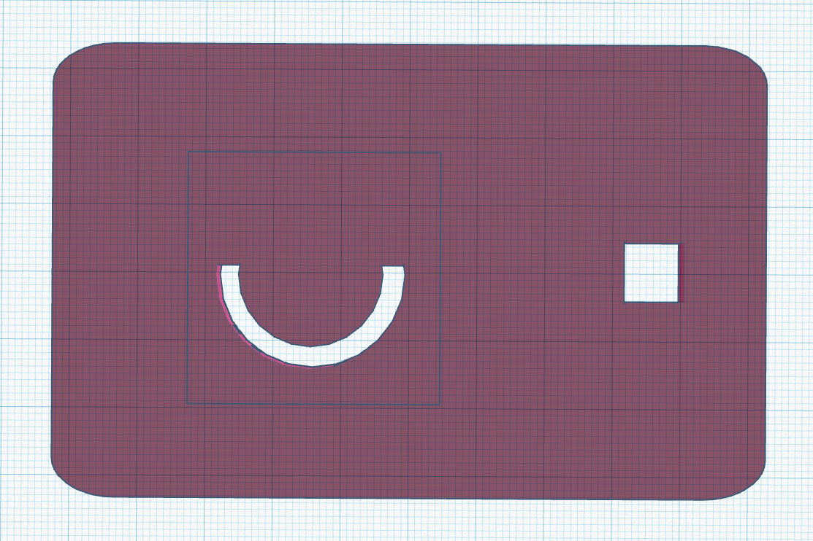
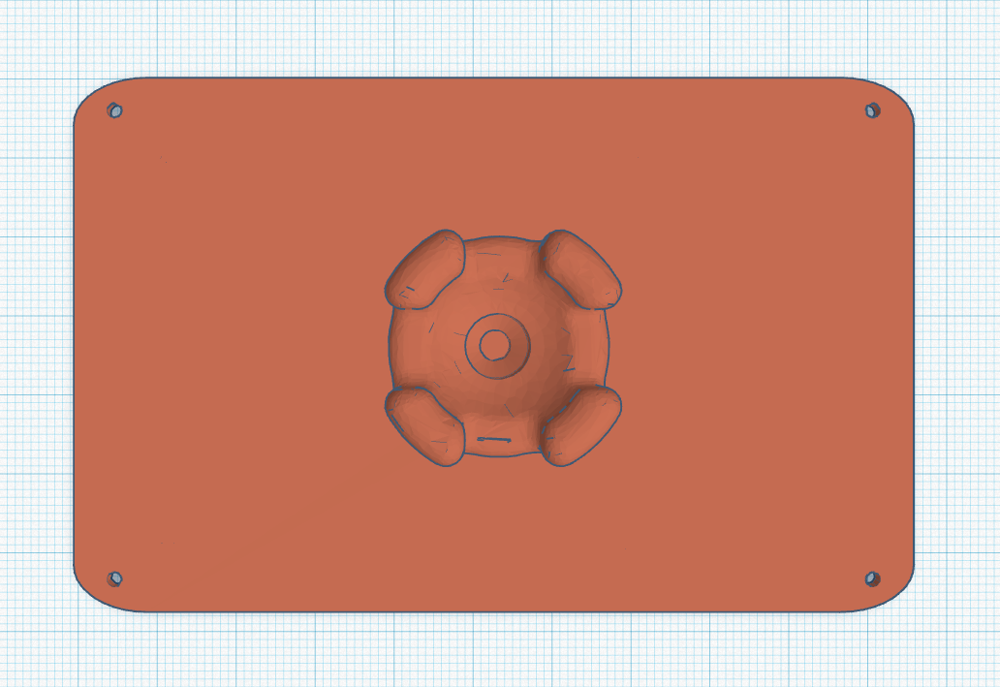
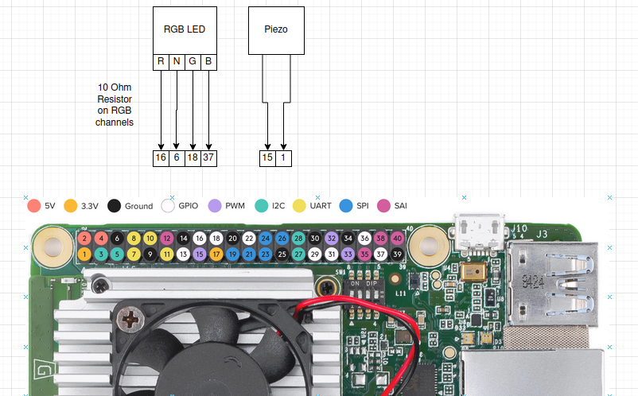

### What is this? / Manifesto

seeOS is an operating system designed to run on homemade AI cameras, specifically the Tree Camera. 

Tree Camera is an open-source camera hardware platform based on the Google Coral platform. Using the on-board edge TPU (tensor processing unit) it can run machine learning applications quickly and efficiently on-device. 

The promise of modern AI cameras to augment manufacturing, enhance safety and security, and enable novel applications has been hindered by general distrust in large corporate interests. We cannot trust the parties who manufacture these devices (Amazon Blink/Ring, Google Nest, Etc) to monitor and analyze sensitive parts of our life unless the devices are made completely open source. 

As an analogy: Suppose we removed the ingredients list from everything at the grocery. 
Would you consume a manufactured product if it's constituents were not disclosed publicly?


Why would you buy a security camera for your home, that truly has access to some of the most sensitive information in your life, if you could not know where exactly the information it collects is getting sent?
The information collected about you by your own cameras could be sent to any government, used by special interests to manipulate you through targeted ads or propaganda, or for even more potentially dastardly orwellian operations.

Moreover, the cameras these companies create are either extremely simplified (where useful AI features are restricted for the sake of user friendliness), or highly technical (granting users a high degree of autonomy but without a standardized packaging system or user interface)

Tree Camera and seeOS provide an alternative to the sparse landscape of smart cameras that is both open-source and user friendly. We want users to have a functional, friendly product that belongs to them. 

In its current state, this platform is in development, so only try to build it if you have a technical inclination. Any technically comfortable person, not necessarily a computer scientist, should be able to assemble this device to a functional state. 

We hope you enjoy using seeOS and look forward to a future where AI video processing technology is not a trope of dystopian science fiction but rather a useful tool by the people, for the people.

### Requirements

  >1. A computer running linux
  >2. 3D printer or means to acquire 3D printed parts
     1. STL files are included for the Ender 3 model of printer
  >3. [Google Coral Dev Board](https://coral.ai/products/dev-board/)
  >4. [Google Coral Camera Module](https://coral.ai/products/camera)
  >5. 16GB or higher capacity MicroSD card
  >6. Soldering Iron
  >7. Piezo speaker
  >8. RGB LED, resistors and F-F jumper wires (The kind included in electronics hobby kits)

## Stage A: Assemble Camera

### 3D print all STL files [here](TreeCamera/stl). 

Print all files on 100% infill at med-low resolution.  
A point of focus in the future would be optimizing the tensile strength of the device.
#### [001_box](TreeCamera/stl/001_box.stl)



#### [002_back](TreeCamera/stl/002_back.stl)


#### [003_shaft_base](TreeCamera/stl/003_shaft_base.stl)


#### [004_ball](TreeCamera/stl/004_ball.stl)


#### [005_screw](TreeCamera/stl/005_screw.stl)


#### [006_screw_pad](TreeCamera/stl/006_screw_pad.stl)


#### [007_vice_body](TreeCamera/stl/007_vice_body.stl)


### 2. Assemble the ball/clamp mechanism


#### A: 004_ball
#### B  60mm x 5mm threaded shaft
#### C: 007_vice_body 
#### D: 006_screw_pad
#### E: 005_screw
#### F: 003_shaft_base

###3: Assemble Camera

#### Wire coal device according to this schematic: 


#### Connect Camera Module to coral


#### Put LED in position with a dot of hot glue


#### Attach camera module to inside of case


##### At this point if you haven't flashed your board yet, skip to stage B and C to flash the operating system and verify your hardware is all connected properly before further assembling the device. 

#### Place coral fan-side-down in case


#### Attach back


#### Connect back to ball/clamp. 


####Tree Camera is now assembled. 

#Stage B: Configure your workstation


How to set up a new Tree Camera flashing host on a fresh Ubuntu 20 install

1. [install MDT](https://coral.ai/docs/dev-board/get-started/#install-mdt)

>  sudo apt install python3-pip screen

>  python3 -m pip install --user mendel-development-tool

> echo 'export PATH="$PATH:$HOME/.local/bin"' >> ~/.bash_profile

> source ~/.bash_profile

2. [Change keys over serial](https://coral.ai/docs/dev-board/serial-console/#connect-with-linux)
> sudo usermod -aG plugdev,dialout <username>

3. reboot
> sudo reboot now

#Step 3: Flash OS

todo: Convert this into a pre-built system image or script. This method is not sustainable!

<h1>This is a working document. </h1>

<h5>This document will instruct you to flash seeOS to a device. </h5>
<h5>At the time of writing, the latest system build is 0.3.</h5>


<h3>Supplies</h3>
<l>
* Tree Camera device (Preferably, not inside a case, in case you need to access the board. Wait until device is fully functional to put in the case. Trust me!)
* 3A USB type C PSU (Can probably get away with 2A)
* USB type C connector (For data to host PC)
* Ubuntu 20 host PC


<h3>Directions</h3>

If you're using an old coral board, you need to run "fastboot 0" through the boards serial console to run these commands. 

... Flash debian (assuming you have this system image)
```
cd $HOME/Downloads
cd mendel-enterprise-day-13
mdt reboot-bootloader # Is this really necessary?
bash flash.sh -H
mdt wait-for-device && mdt shell
```


... System hostname and Edit system hosts

```
nmcli general hostname tree
sudo sh -c 'echo "127.0.0.1       localhost
::1             localhost ip6-localhost ip6-loopback
ff02::1         ip6-allnodes
ff02::2         ip6-allrouters
127.0.0.1 tree" > /etc/hosts'
echo ssh-rsa 'AAAAB3NzaC1yc2EAAAADAQABAAACAQChDeAOf7P8+4QA5uoULBl2DwPSkPJwNX0VrYCnqpXf/V/6Av68mGqJhNzmT7eYetmeOUxDBBwK0QGKrcY8gfpO8CnjgGx/R1ThXasSDV5Adz8+3j+VPWVaQBzMarukn+TfEm8g17MrXE+cx1VqJ+8AYMKxEPdPnowhPavGa/z1R3bUPL4yMLCyw50nmsq67kvxiFM8MFlbKBXpmLcpAwIOiLN7cp/g+S1SaIvcKY3kBraWLF3a7IfY1IEanmcbqaio8Y9OskCtZha11L1WbGS/xWd59MKTSOJteEV5zkVFEhy51aKtyoyWVK9/8DCa/vY37e1pta5SkMsB/0o7fbHT7tt/nVZHTlayLpNCSrk/DRnCpJlyUQRs+tB5UZahvoTIYnlQgCJ8WXsKiZGJDny9Lmnb9s3ZYllw0+2IECnzXANCOaq6I0zUmTw+4GMtb3f9wDxsdvOK8hUt/iSCHl580lh0htePdKxiee6VzLoaruQcwulje5+UJIwDinOGAC0/LBDnOb8FU4j/iN3Fjp99BQg9WztQaAqBc4PPRATUZOtmY2ajzCx0hMCKkGCfHdyUYx4qCz8JMT3G4O59pSgl8bSAqbMtsqzeBaeYrETv3QwHwjxmuWiHhwzk8wzTFVsGqrpXWhcwvfshrEX9vJRPfW6Rnl0nkCUD1s4lnw5JQQ== corcordp@mail.uc.edu' >> .ssh/authorized_keys
sudo reboot now 
```
 ... Find your SSH key with
```angular2html
cat ~/.ssh/id_rsa.pub

```

... At this point, reboot the camera (```sudo reboot now```) and make sure your SSH keys work. You should be able to run this without a password. 
```
  ssh-keygen -f "/home/daniel/.ssh/known_hosts" -R "tree.local"
ssh mendel@tree.local
```
you may need to run 
```

```
If you have worked on a different board on this PC since they will have colliding hostnames

... format the SD card 
```
sudo fdisk /dev/mmcblk1
// create new partition. If this step gives you an error (bc of pre-existing partition), try deleting (d) first, then try again. 
Command (m for help): n
// Use the defaults, if it asks you to remove signature, say No [N]
// make this a primary partition, leave default values for first and last sector
Command (m for help): p
// Write it (by default fdisk will make this a ext4 partition)
Command (m for help): w
```
```sudo fdisk -l``` should show something like this:
```
Disk /dev/mmcblk1: 29.7 GiB, 31914983424 bytes, 62333952 sectors
Units: sectors of 1 * 512 = 512 bytes
Sector size (logical/physical): 512 bytes / 512 bytes
I/O size (minimum/optimal): 512 bytes / 512 bytes
Disklabel type: dos
Disk identifier: 0x2aaeb742

Device         Boot Start      End  Sectors  Size Id Type
/dev/mmcblk1p1       2048 62333951 62331904 29.7G 83 Linux
```

Mount the SD Card under /home/mendel/sdcard
```
# This one usually takes a few minutes
y | sudo mkfs.ext4 /dev/mmcblk1p1

mkdir sdcard          
sudo mount /dev/mmcblk1p1 sdcard
sudo chmod 777 sdcard 
mkdir sdcard/tree

# Make the important system files editable. 
sudo chmod 666 /etc/fstab
sudo chmod 666 /etc/sysctl.conf

# Allocate a swap file on the SD Card. We will make the swappiness low to reduce wear.
 
sudo fallocate -l 2G /home/mendel/sdcard/swapfile
sudo chmod 600 /home/mendel/sdcard/swapfile
sudo mkswap /home/mendel/sdcard/swapfile
sudo swapon /home/mendel/sdcard/swapfile

# These commands make changs permanent. 
sudo echo " /dev/mmcblk1p1 /home/mendel/sdcard ext4 defaults 0 1" >> /etc/fstab
sudo echo "/home/mendel/sdcard/swapfile none swap sw 0 0" >> /etc/fstab
sudo echo "vm.swappiness=10" >> /etc/sysctl.conf

#Now we edit rc.local to add the bootup script

sudo sh -c 'echo "#!/bin/bash -e
chmod +x /home/mendel/sdcard/tree/bootloader.sh
/bin/bash /home/mendel/sdcard/tree/bootloader.sh
exit 0

" > /etc/rc.local'

sudo chmod +x /etc/rc.local

```

debug mode
```
echo 'alias debug="sudo pkill -9 python3; cd ~/sdcard/tree/; python3 boot.py"' >> ~/.bashrc
```


... SCP OS file (from host system.)
```
rsync -avh seeOS/ mendel@tree.local:/home/mendel/sdcard/tree

```

... connect it to wifi using nmtui. 

```
sudo apt -y update && sudo apt -y upgrade && sudo apt -y dist-upgrade

sudo apt-get -y install git build-essential cmake unzip pkg-config libjpeg-dev libpng-dev libtiff-dev libavcodec-dev libavformat-dev libswscale-dev libv4l-dev libxvidcore-dev libx264-dev libgtk-3-dev libatlas-base-dev gfortran python3-dev python3-opencv
sh -c "yes | sudo pip3 install flask waitress psutil imutils  flask-login PyOpenGL-accelerate  twilio imgurpython wget tornado terminado dlib face_recognition"

# At this point the setup is over and you can assemble the device. 

```
<h1>Help</h1>
Did something go wrong? If you cannot SSH into the board using MDT shell or SSH, connect using the USB serial port. Log in via this. Then run 

```
mdt reboot-bootloader
this puts the board in fastboot mode, so you can re-flash the operating system
```
To restart the board into fastboot mode. This is effectively a factory reset. 
(I've probably had to do this 10,000 times.)
